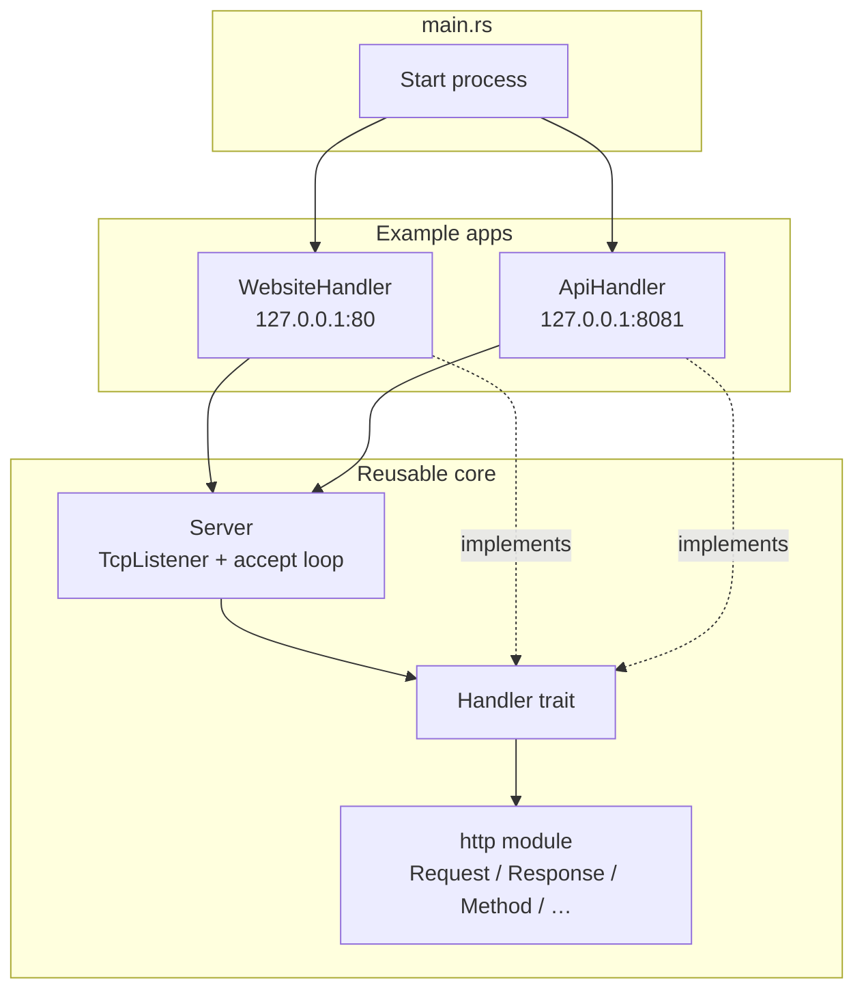
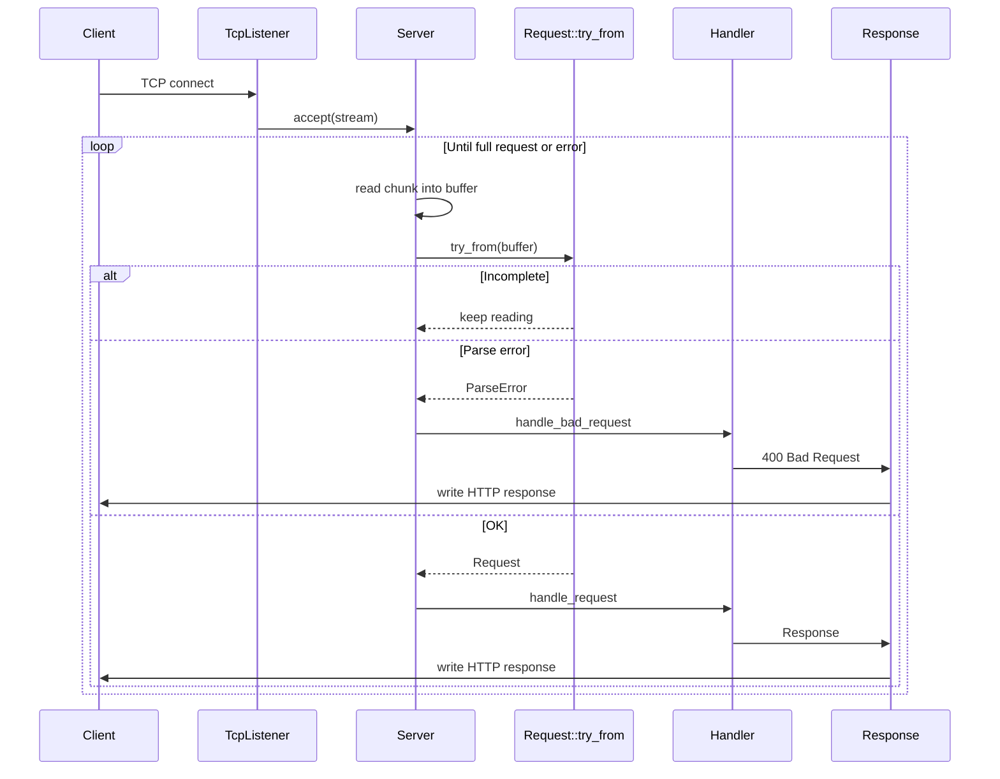
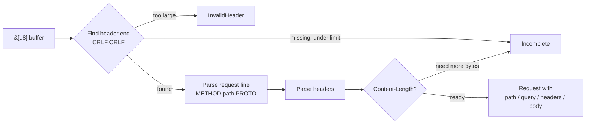
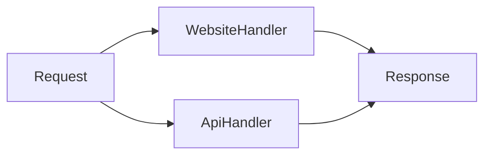

# http-server

A tiny **from-scratch HTTP/1.1 server** in Rust — no frameworks, no crates. Built to learn how HTTP and a TCP server fit together.

The protocol stack (`http` + `server`) is separate from the demo apps under `example`.

## Architecture

```text
src/
├── main.rs           # Starts the two example apps
├── server.rs         # TCP accept loop + Handler trait
├── http/             # HTTP/1.1 types (parse request, build response)
│   ├── request.rs
│   ├── response.rs
│   ├── method.rs
│   ├── status_code.rs
│   ├── headers.rs
│   └── query_string.rs
└── example/          # Demo handlers only (not part of the protocol)
    ├── website.rs    # Simple site on :80
    └── api.rs        # JSON-ish API on :8081
example/data/         # Fixtures for the API demo
```



## Request lifecycle

One TCP connection, end to end:



Parse details inside `Request::try_from`:



`Request` borrows from the connection buffer (`Request<'buf>`), so path, headers, query, and body are slices — no extra string copies for those fields.

## Handler model

Apps plug in via a trait. The server owns I/O and parsing; handlers own routing and business logic.

```rust
pub trait Handler {
    fn handle_request(&mut self, request: &Request) -> Response;

    fn handle_bad_request(&mut self, e: &ParseError) -> Response {
        // default: 400 Bad Request
    }
}
```



| Handler | Bind | Routes |
|---------|------|--------|
| `WebsiteHandler` | `http://127.0.0.1:80` | `GET /`, `GET /hello`, `POST /echo` |
| `ApiHandler` | `http://127.0.0.1:8081` | `GET /`, `GET /items`, `POST /items` |

`main` runs the API on a background thread and the website on the main thread.

## Running locally

Port 80 needs elevated privileges on most systems:

```bash
sudo cargo run
```

Try it:

```bash
# Website
curl http://localhost/
curl http://localhost/hello
curl -d 'ping' http://localhost/echo

# API (items loaded from example/data/items.txt)
curl http://127.0.0.1:8081/
curl 'http://127.0.0.1:8081/items?q=berry&page=1&limit=2'
curl -d 'dragonfruit' http://127.0.0.1:8081/items
```

## Tests

Unit tests live next to the HTTP parsers (`request`, `headers`, …):

```bash
cargo test
```

CI (`.github/workflows/ci.yml`) runs `cargo test --all --locked` on pushes and PRs to `main`.

## What this project is (and isn’t)

**Is:** a small learning lab for HTTP/1.1 over TCP, Rust modules/traits/lifetimes, and a clean split between protocol and app code.

**Isn’t:** a production server. No TLS, HTTP/2, keep-alive pooling, async runtime, or security hardening — use something like nginx or a real Rust framework for that.
